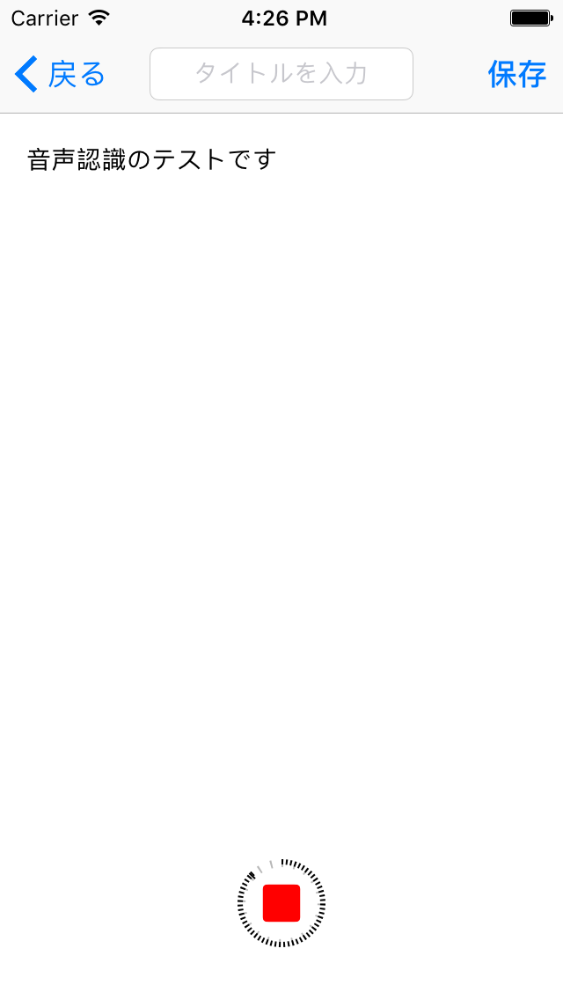
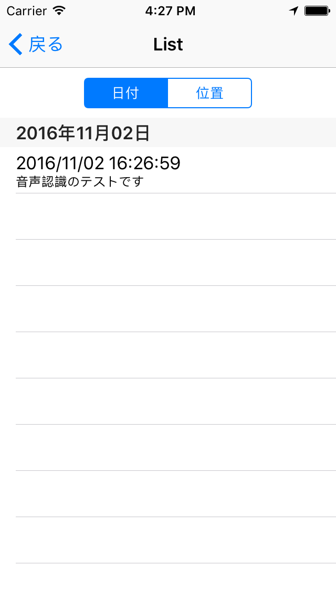
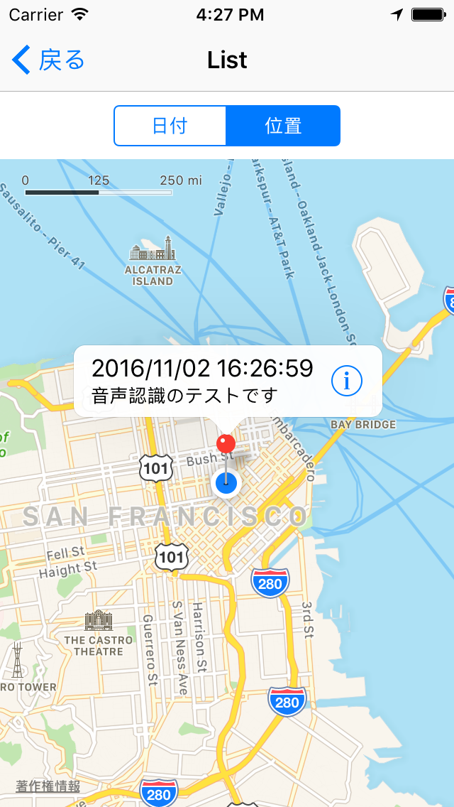

# QuickSpeechMemo
QuickSpeechMemo is the iOS app you can make notes by speech recognition.  
iOS10で追加された音声認識を利用したメモアプリです。

## Compatibility
- iOS 10.0+
- Xcode 8.0+
- Swift 3.0+

## Installation
1. Run `carthage update` for building frameworks.
```
carthage update --platform ios --no-use-binaries
```
1. Open `QuickSpeechMemo.xcodeproj`
1. Run and launch

## Screen Shot




## Notes
[Speech | Apple Developer Documentation](https://developer.apple.com/reference/speech)

:warning: 音声認識の利用に下記の制限事項があります
- １日あたりの使用回数
- 連続した音声認識の時間（１分）

:warning: インターネットの接続が必要です

:warning: バッテリーを多く消費します

:warning: 内容はAppleのサーバーに送信されます。パスワードなどのプライバシーに関わる情報は入力しないようにしてください。
